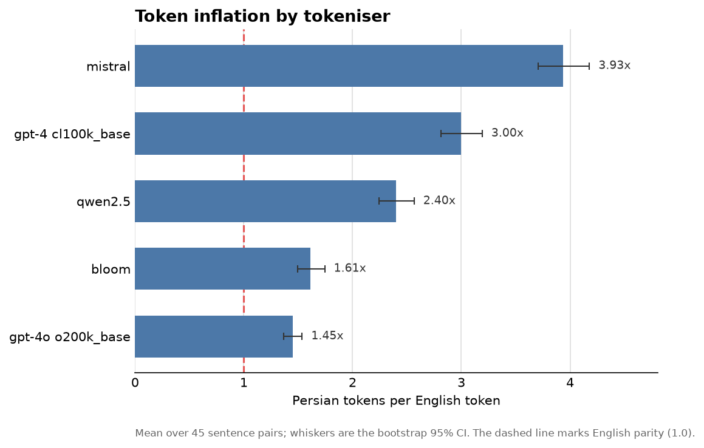
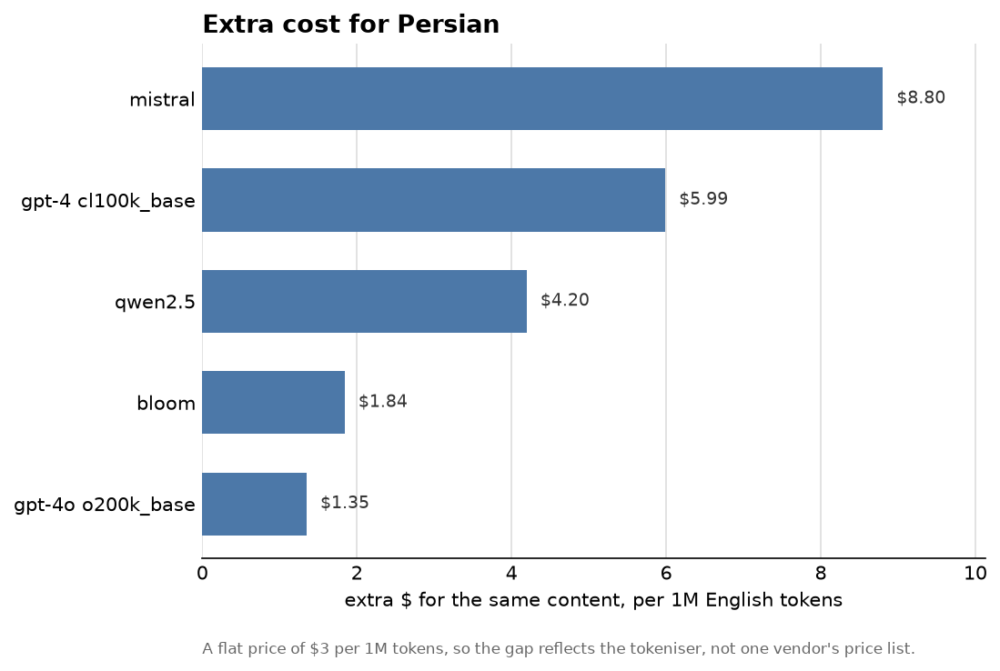
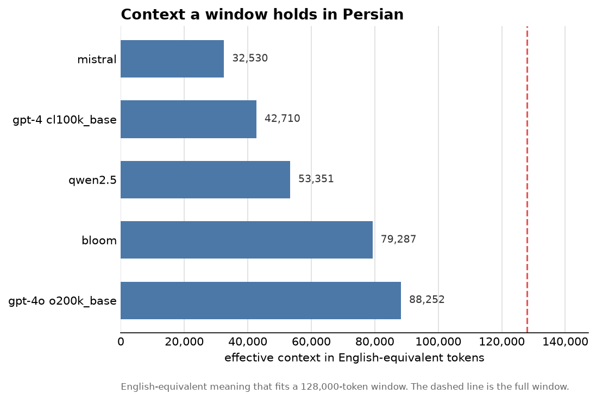

# PersianTokenBench

[](https://github.com/Jawadnoori1718/PersianToken/actions/workflows/ci.yml)

**Token Tariffs**: measuring the tax Persian speakers quietly pay per token.

## What this is

I'm measuring how much more it costs to process Persian (Farsi) text than
English, purely at the tokeniser level. Language models charge and compute per
token. If the same meaning turns into far more tokens in Persian than in English,
then Persian speakers pay more, wait longer, and hit context limits sooner for
identical content.

This is a local measurement project. It does not call any paid model APIs. Every
tokeniser here runs locally and for free, so anyone can reproduce the numbers
without a bill.

## The headline

For the same meaning, Persian costs more tokens than English on every tokeniser I
tested, from about 1.45 times as many at best to about 3.93 times at worst. Even
the best case is a 45 per cent surcharge; the worst nearly quadruples the bill.

Persian tokens per English token, over 45 sentence pairs, worst to best:

| tokeniser | ratio | 95% CI | extra cost | context lost |
| --- | --- | --- | --- | --- |
| mistral | 3.93 | 3.71 to 4.18 | +293% | 75% |
| gpt-4 (cl100k_base) | 3.00 | 2.81 to 3.19 | +200% | 67% |
| qwen2.5 | 2.40 | 2.24 to 2.57 | +140% | 58% |
| bloom | 1.61 | 1.49 to 1.74 | +61% | 38% |
| gpt-4o (o200k_base) | 1.45 | 1.37 to 1.54 | +45% | 31% |



The full write-up, with the cost and context models and an honest limitations
section, is in [FINDINGS.md](FINDINGS.md).

## Why it matters

Prices and context windows are quoted in tokens, not in words or in meaning. That
quietly favours English, because most tokenisers learned from mostly English text
and split other scripts into more pieces. Persian uses the Arabic script, reads
right to left, joins its letters, and often gets broken into many small tokens. So
a Persian sentence and its English translation can carry the same meaning at very
different token costs.

I call this the token tariff: a surcharge you pay per token simply for writing in
Persian. The interesting part is that the tariff is not fixed. The newer, more
multilingual vocabularies (gpt-4o's o200k, and BLOOM) treat Persian far more
fairly than the English-first ones (cl100k, Mistral). It is a design choice, not a
law of nature.

## The cost and the context

At a flat price of three dollars per million tokens, Persian pays the extra above
for the same content. And a context window quoted in tokens holds much less
Persian meaning than English.





## Quickstart

Needs Python 3.11 or newer.

```bash
python3.12 -m venv .venv
source .venv/bin/activate
pip install -e ".[dev]"

ptb tokenise    # count every sentence   -> results/token_counts.csv
ptb metrics     # ratios + bootstrap CIs -> results/summary.csv
ptb cost        # extra cost for persian -> results/cost.csv
ptb context     # context lost           -> results/context.csv
ptb plot        # the three figures      -> figures/
```

The committed results run on a small hand-authored sample, so everything works
out of the box. For the larger FLORES-200 corpus, follow [DATA.md](DATA.md) and
rerun. The bootstrap is seeded, so the confidence intervals are identical on
every run.

Or run the whole pipeline in one command with `make all`. The `make` targets go
through `PYTHONPATH=src`, so they keep working even if the editable link drops.

> On macOS with Homebrew, an editable install can lose its link between sessions.
> If `ptb` reports it cannot find the package, re-link with
> `pip install -e . --no-deps`, or run any command as
> `PYTHONPATH=src python -m persiantokenbench.cli <command>`.

## How it works

- A tokeniser adapter layer (`src/persiantokenbench/adapters/`) wraps tiktoken and
  Hugging Face behind one small interface, and skips any tokeniser it cannot load.
- The measurement writes raw per-sentence counts to CSV, so every number is
  inspectable rather than hidden.
- The metrics module computes per-sentence and aggregate ratios, with seeded
  bootstrap confidence intervals because the ratios are skewed.
- The cost and context models turn the ratio into money and lost context.

## Tokenisers

- The GPT family via `tiktoken` (cl100k_base and o200k_base).
- Open models via Hugging Face: Llama 3, Qwen2.5, Mistral, Gemma, and BLOOM as a
  multilingual contrast. Llama 3 and Gemma are gated, so they run only once you
  have logged in to Hugging Face and accepted their terms; otherwise they are
  skipped with a warning.

## Data

The committed sample is 45 English and Persian pairs I wrote and translated
myself, so the pipeline runs with no download. The headline corpus is FLORES-200,
built locally. Sources and licences are in [DATA.md](DATA.md).

## Licence

MIT, see [LICENSE](LICENSE). The data has its own terms, set out in
[DATA.md](DATA.md).
